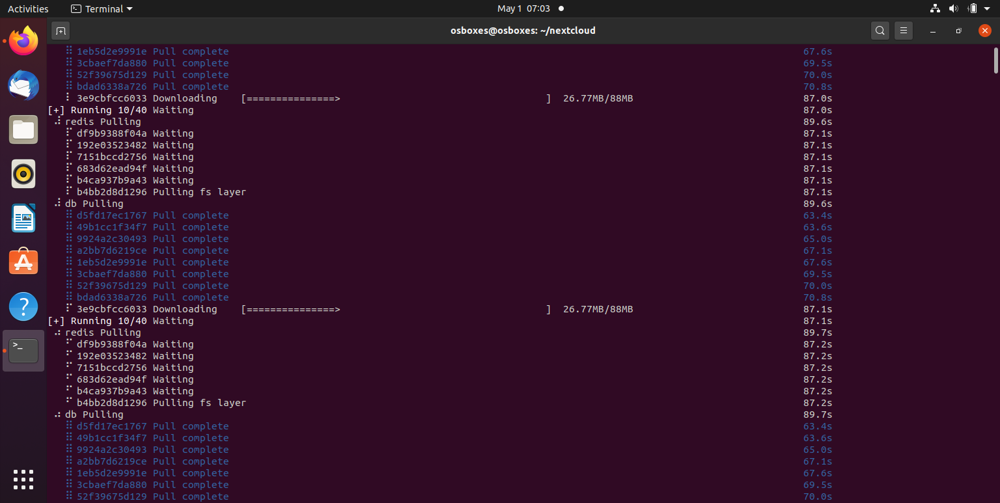
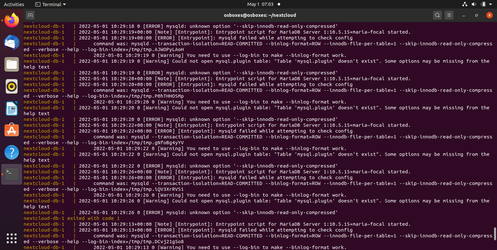
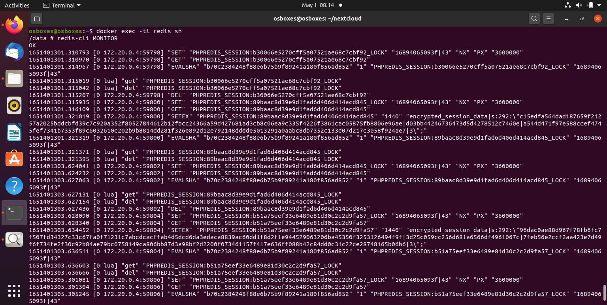

# Verslag Opdracht 5 deel2 (docker)

## Stap 1: Installatie Nextcloud

We maken eerst een extra folder aan genaamd nextcloud om de docker-compose.yml in aan te maken
De docker-compose.yml wordt dan opgesteld.
Voor de wachtwoorden worden omgevingsvariabelen gemaakt, wachtwoorden zouden namelijk niet in plain-text mogen staan.
Hieronder de inhoud van het docker-compose.yml file.
```

version: '2'

volumes:
  nextcloud:
  db:

networks:
  nextcloud_network:
    external: false

services:
  db:
    image: mariadb:10.5
    restart: unless-stopped
    command: --transaction-isolation=READ-COMMITTED --binlog-format=ROW
    volumes:
      - db:/var/lib/mysql
    environment:

      - MYSQL_ROOT_PASSWORD=${rootpwd}
      - MYSQL_PASSWORD=${pwd}
      - MYSQL_DATABASE=${database}
      - MYSQL_USER=${user}
    networks:
      - nextcloud_network

  app:
    image: nextcloud
    restart: unless-stopped
    ports:
      - 420:80
    links:
      - db
    volumes:
      - nextcloud:/var/www/html
    environment:
      - MYSQL_PASSWORD=${pwd}
      - MYSQL_DATABASE=${database}
      - MYSQL_USER=${user}
      - MYSQL_HOST=${host}
      - REDIS_HOST=redis
    networks:
      - nextcloud_network

  redis:
    image: redis:alpine
    container_name: redis
    volumes:
      - /docker/nextcloud/redis:/data
    networks:
      - nextcloud_network
    restart: unless-stopped
    
```
Origineel was het de bedoeling om nextcloud op poort 8080 te zetten. Deze poort was echter al bezet door vaultwarden, dus is er gekozen voor poort 420.
Met het commando `docker compose up -d` wordt het bestand uitgevoerd. Het duurt een tijdje vooraleer alles is opgestart



Nadat het opstarten voltooid is wordt gecontroleerd of alles goed is verlopen met `docker compose logs --follow`
Het volgende werd vastgesteld:



In het docker-compose.yml stonden functies die overbodig waren en voor errors zorgden, dus deze werden verwijdert uit de file.
Er werd nogmaals `docker compose up -d` en `docker compose logs --follow` uitgevoerd, geen errors meer op te merken.

Verder werd `docker ps` en `sudo ss -tlnp` uitgevoerd om na te kijken of de containers wel degelijk actief waren en op welke poort ze actief zijn.
Vervolgens werd het adres localhost:420/ ingevoerd in een browser en kwam men op een nextcloud pagina.

## Stap 2: Commando's uitvoeren in een container

Er wordt getest ofdat de redis container wel degelijk werkt.

Om dit te bereiken werd `docker exec -ti [NAAM_REDIS_CONTAINER] sh` uitgevoerd. In dit geval was de naam van de container simpelweg 'redis'.
Hierdoor wordt een shell gestart in de redis container.
Na invoeren van `redis-cli MONITOR` in de shell refresht men de nextcloud pagina in de browser.
Dit is het resultaat dat men bekomt bij het refreshen



## Stap 3: Environment variables

De gebruikte variabelen worden in een .env bestand gestoken.

In Stap 1 werd er reeds een map genaamd nextcloud aangemaakt. Deze map bevat enkle de docker-compose.yml.
Nu wordt er nog een extra bestand, .env aangemaakt in de map.
Dit bestand zal de variabelen bevatten die gebruikt worden in de docker-compose.yml.
Aangezien zowel de docker-compose.yml en de .env file in dezelfde map zitten, hoeft de docker-compose.yml niet aangepast te worden met een verwijzing naar de .env.
docker-compose.yml zal automatisch de variabelen die in het .env bestand staan inlezen.


